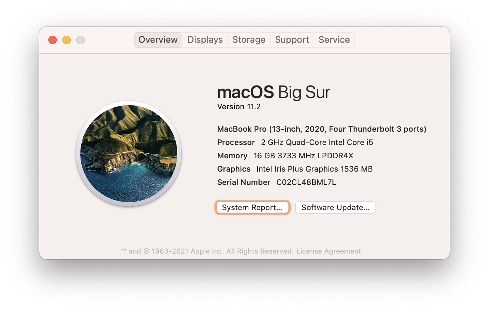
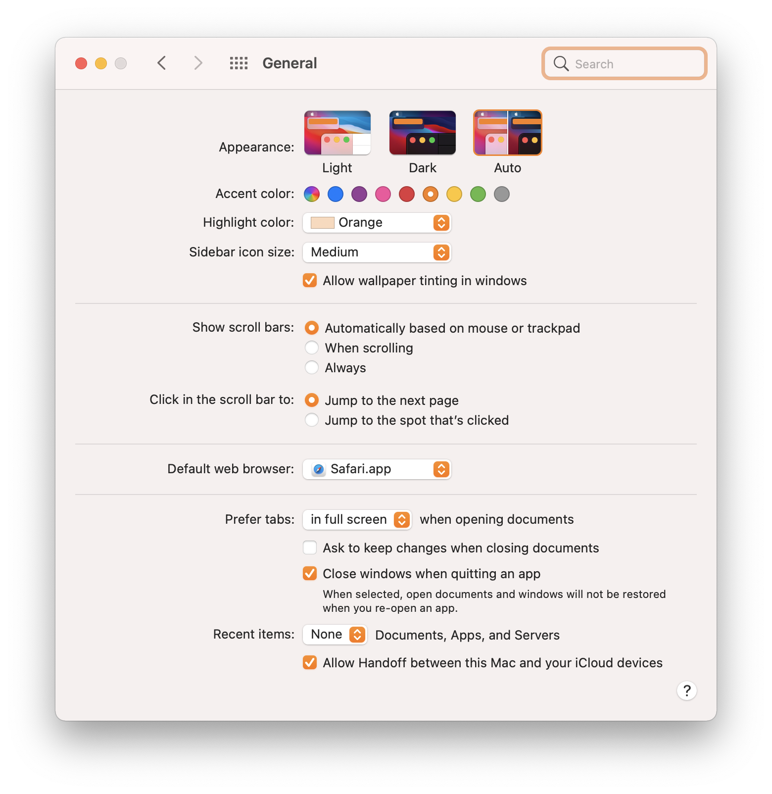
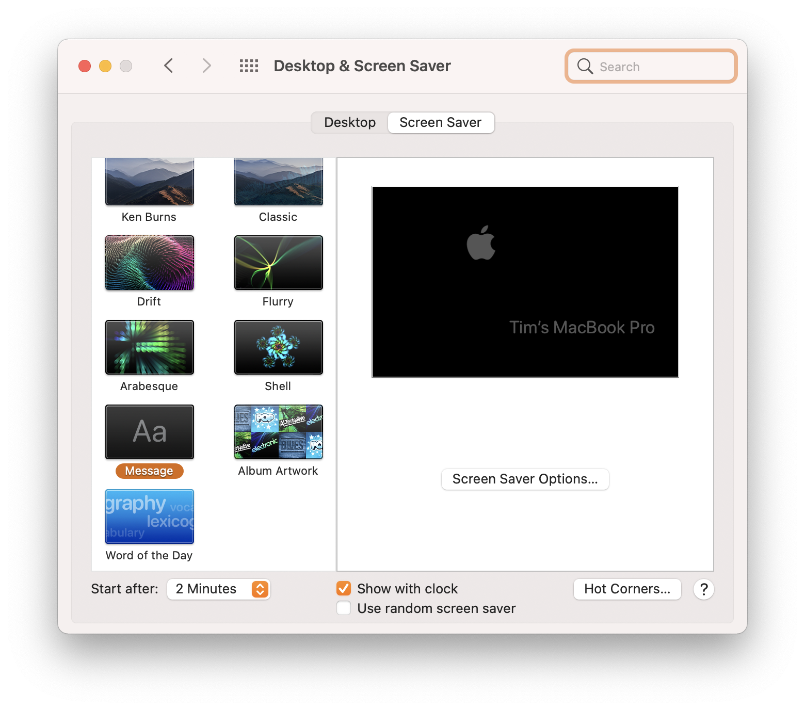
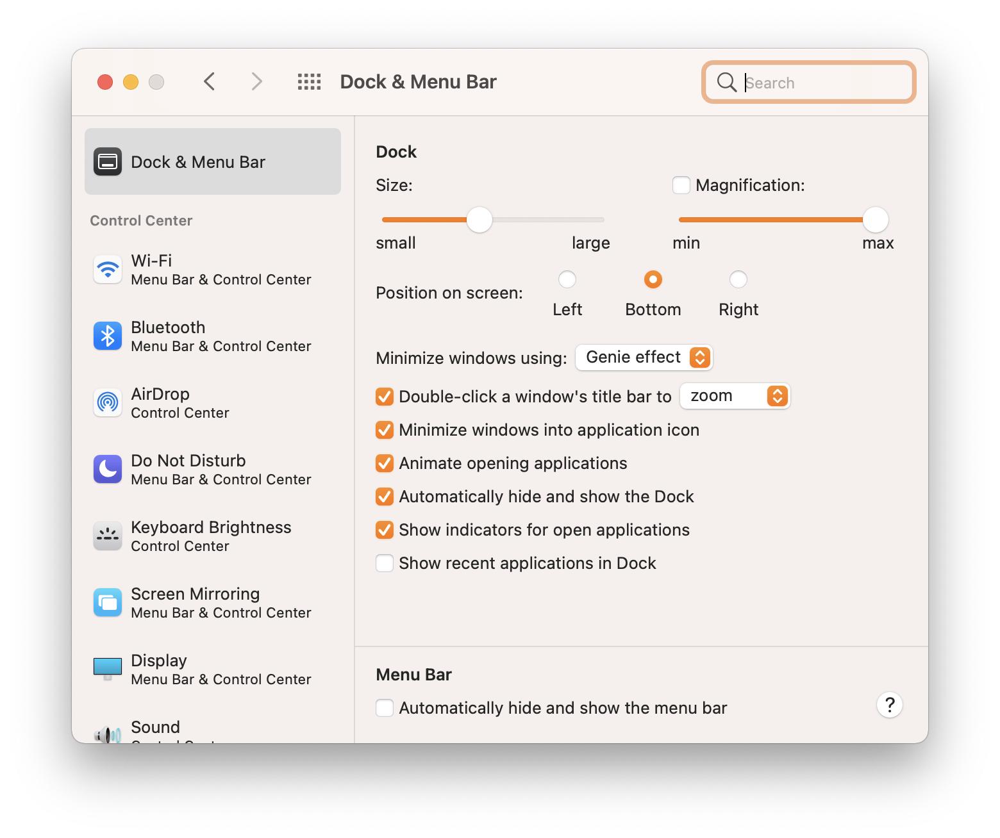
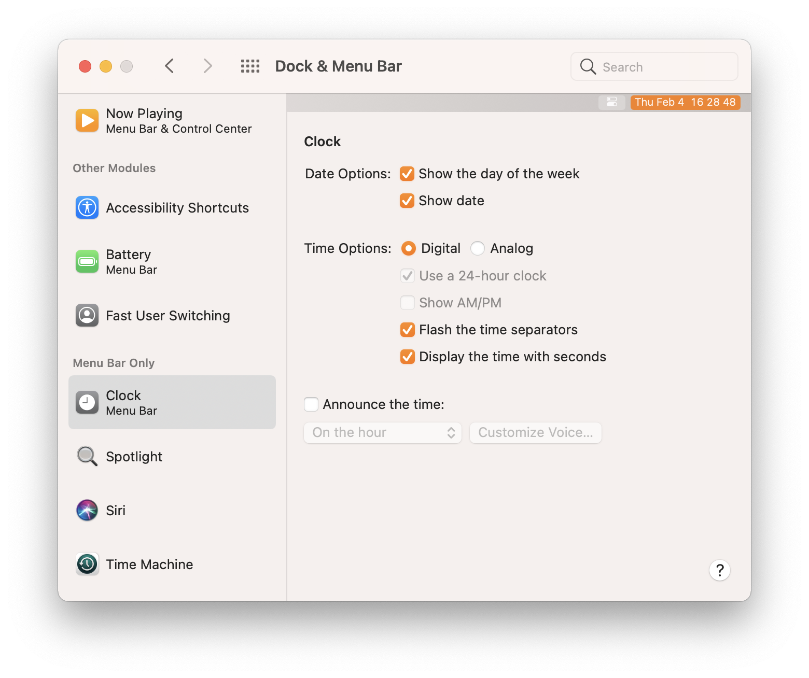
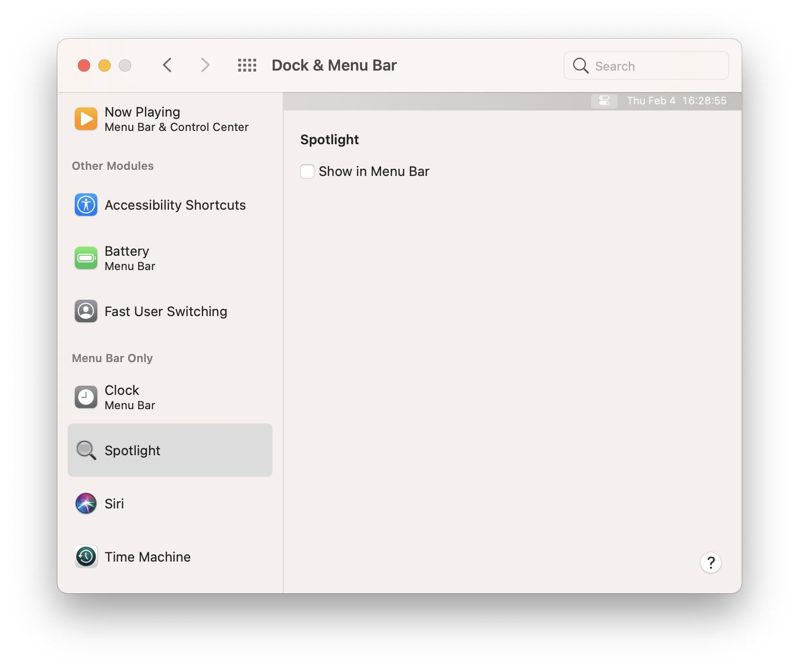
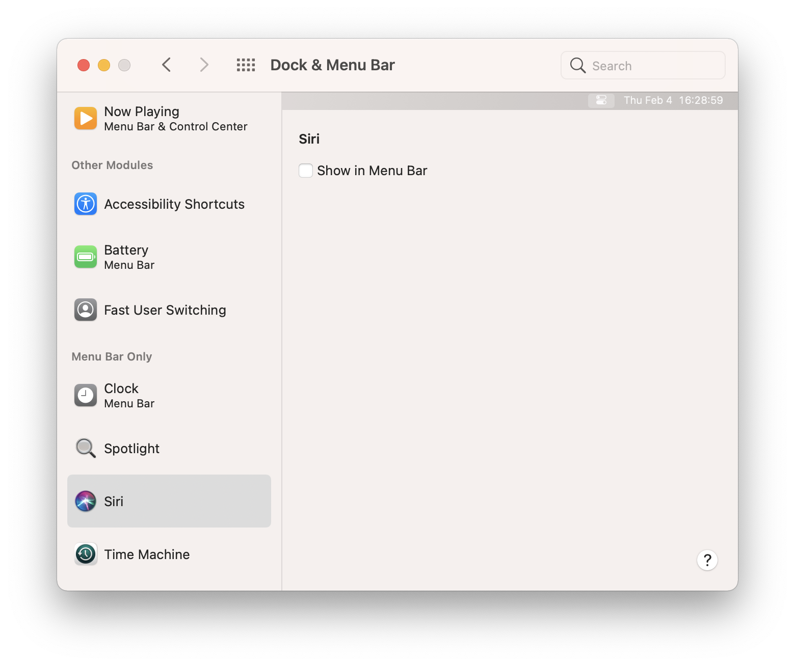
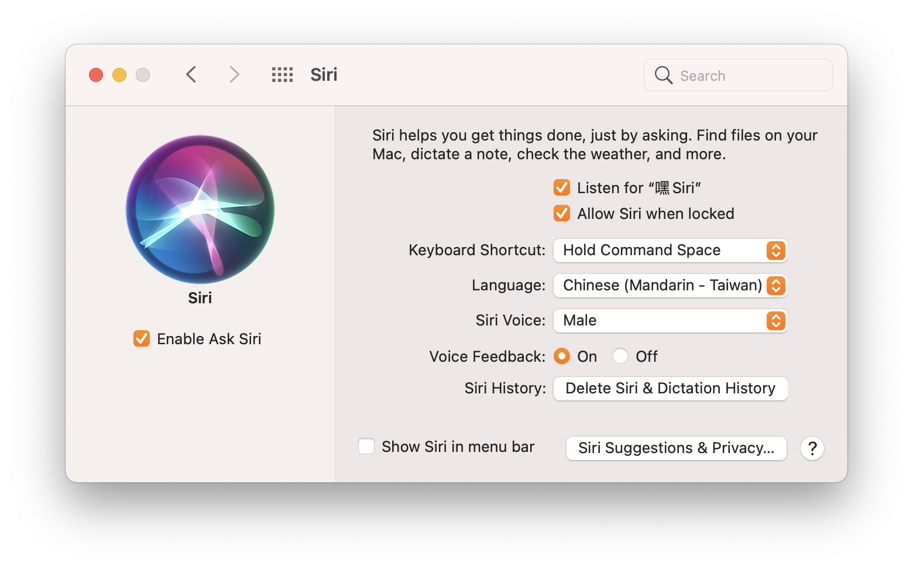
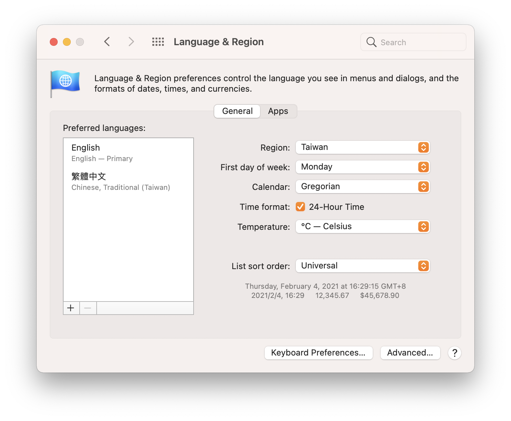
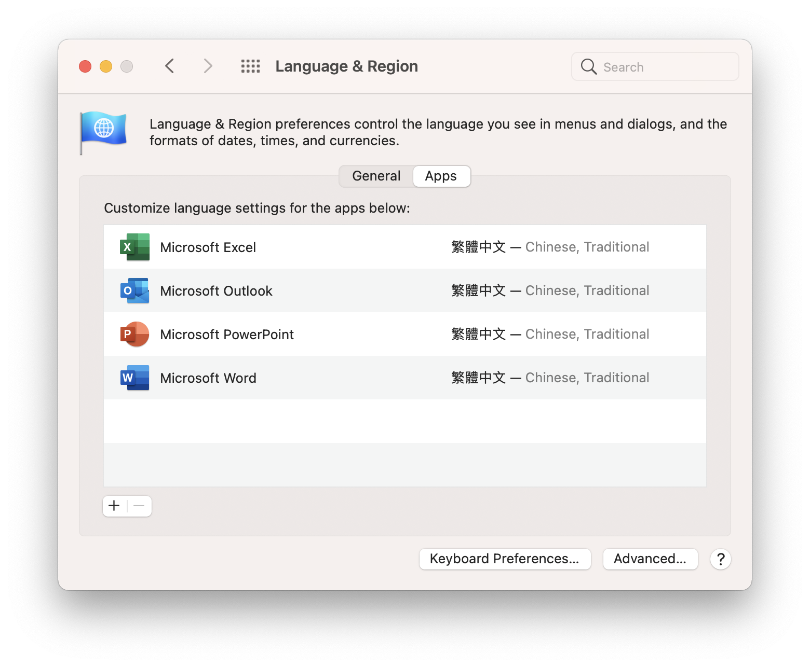

# **macOS Big Sur Developer Setup**

# **System Preference**

`Change Recent Items`: None

`Start After`: 2 Minutes
`Check Show with clock`










**Clone this project**
---
```sh
cd ~
git clone https://github.com/Chindada/macOS_11_setup.git
cd macOS_11_setup
chmod -R 777 ./
```

## Steps

```sh
sudo xcode-select --install
sudo softwareupdate --install-rosetta
```

```sh
flutter doctor
flutter pub global activate devtools
flutter doctor --android-licenses
```

```sh
go get -u github.com/beego/beego/v2
go get -u github.com/beego/bee/v2
asdf reshim golang
```
## Deployment

Add additional notes about how to deploy this on a live system

## Authors

- **Tim Hsu** 

