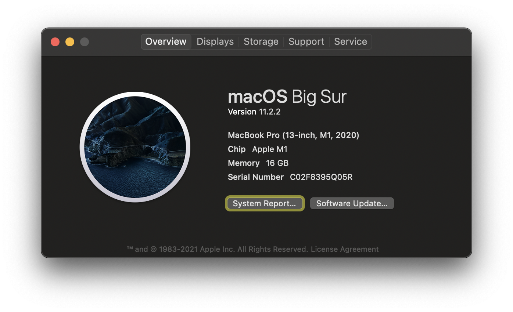

# **macOS Big Sur Developer Setup**

**Clone this project**
## Initial

---
```sh
sudo xcode-select --install
sudo softwareupdate --install-rosetta
```
```sh
git clone https://github.com/Chindada/macOS_11_setup.git ~/dev_projects/macOS_11_setup
chmod -R 777 ~/dev_projects/macOS_11_setup
```
```sh
cd ~/dev_projects/macOS_11_setup/apple_sillicon
./install.sh
```
## Post-Steps
```sh
rm -rf ~/dev_projects/macOS_11_setup
git clone git@github.com:Chindada/macOS_11_setup.git ~/dev_projects/macOS_11_setup
```
```sh
flutter doctor
flutter pub global activate devtools
```
```sh
go get -u github.com/beego/beego/v2
go get -u github.com/beego/bee/v2
```
```sh
smartctl -a disk3s1s1
```
## Deployment


## Authors

- **Tim Hsu** 

